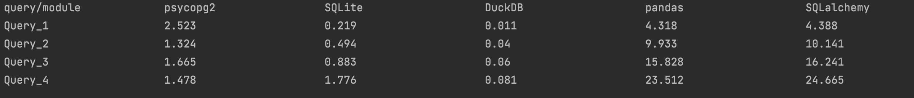
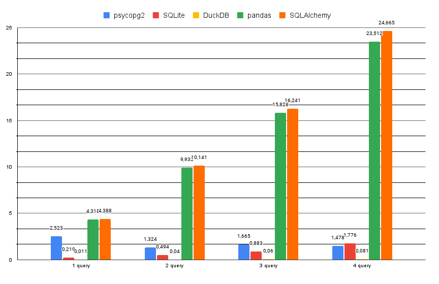

# Benchmark 4 queries

## Оглавление
- [Оглавление](#оглавление)
- [Запуск программы](#1запуск-программы)
- [Модули](#модули)
  - [Psycopg2](#psycopg2)
  - [SQLite3](#sqlite3)
  - [DuckDB](#duckdb)
  - [Pandas](#pandas)
  - [SQLAlchemy](#sqlalchemy)
- [Результаты запусков](#результаты-запусков)
- [Вывод](#вывод)
***
## Запуск программы 
1. Клонирование репозитория
2. Установить соответствующие библиотеки: `pip install psycopg2`, `pip install pandas`, `pip install duckdb`, `pip install sqlalchemy`
3. Запуск программы main.py
4. Ввести адрес вашего .csv файла (данные из базы данных "New York Taxi Cars") и данные для подключения к `PostgreSQL`
> [!NOTE]
> В исходных данных (nyc_yellow_tiny.csv, nyc_yellow_big.csv) присутствует ошибка! Последний столбец дублируется => ошибка sql и ошибка заполнения столбцов!
## Модули
### Psycopg2
Данный модуль является драйвером базы данных PostgreSQL, для выполнения операций на Python
Краткая характеристика:
- хорошая производительность
- широкие возможности для настроек соединения
### SQLite3
Данный модуль является встроенным в Python3 для работы с базой данных SQLite
Краткая характеристика:
- простота использования
### DuckDB
Данный модуль является 
Краткая характеристика:
- отличная производительность при больших объемов данных
### Pandas
Данный модуль является библиотекой Python для обработки и анализа данных
Краткая характеристика:
- мощные средства для манипуляций и анализа данных
- простота использования
- требует больших объемов памяти при обработке больших наборов данных
- проблемы с производительностью при работе с большими объемами данных
### SQLAlchemy
Данный модуль является 
Краткая характеристика:
- поддержка различных СУБД
- сложность с освоением
- проблемы с производительностью при работе с большими объемами данных
## Результаты запусков
Результат работы на данных размером 2ГБ [c]

Сравнение времени работы [с]

## Вывод
По результатам бенчмарка можно сделать вывод:
- `DuckDB` работает быстрее всех, поскольку данная база данных разрабатывалась специально для выполнения сложных запросов на больших объемов данных
- `SQLite3` обладает хорошей скоростью, потому что 1) обладает относительно простой структурой 2) хорошо оптимизирован для операций чтения данных
- `Psycopg2` выполняет sql-запросы быстро благодаря эффективной реализации протокола обмена данными с базой данных, однако время зависит также от задержки при обращении к базе данных
- `Pandas` работает медленно, потому что 1) хранит весь набор данных в памяти, что может привести к низкой производительности 2) отсутствие оптимизации обработки данных
- `SQLAlchemy` медленен, т.к. этот модуль является слоем абстракции между базой данных и приложением => медленные запросы